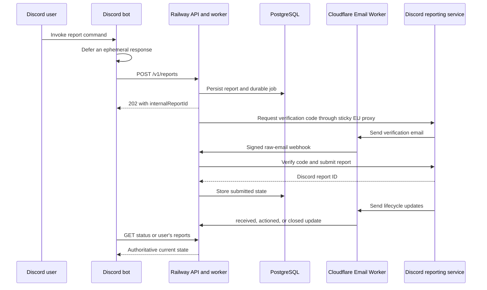

# Discord Bot API Integration Guide

Status: canonical bot-facing contract<br>
Base URL: `https://discord-dsa-production.up.railway.app`<br>
Last verified: 2026-07-19

This document is the source of truth for a Discord bot that creates and tracks
authorized EU DSA reports through the hosted reporting service. The bot must call this
Railway API. It must not call Discord's reporting endpoints, parse verification email,
generate reporter identities, or manage residential proxies itself.

## 1. Architecture and responsibility boundary



The backend owns:

- country-appropriate pseudonym and catch-all email generation;
- one sticky, country-specific proxy session for the report lifecycle;
- Discord fingerprint, cookie, verification-code, token, and menu handling;
- live breadcrumb resolution from the current Discord menu;
- durable jobs, retries, report ownership, and lifecycle-email correlation;
- encrypted transient Discord session state.

The bot owns:

- command permissions and user-facing validation;
- setting `submitterDiscordUserId` from the authenticated interaction user;
- generating and retaining idempotency keys;
- preventing one Discord user from viewing another user's report;
- ephemeral Discord responses and appropriate moderation/audit policy;
- choosing truthful report content and the correct semantic `reportType`.

## 2. Assumptions and non-goals

- Expected volume is tens of concurrent reports, not thousands per second.
- A report can take seconds or minutes because email delivery is asynchronous.
- The bot and API are controlled by the same organization.
- The bot runs on a trusted server; the API key is never shipped to a Discord client.
- The API is the sole report database. The bot does not duplicate report state.
- Bot-side automatic lifecycle retry, arbitrary reporter names, and arbitrary reporter
  emails are intentionally unsupported.
- The backend localizes the identity, proxy, locale, and timezone by country. Discord's
  final form-language field is independently fixed to the known-supported value `en`.

## 3. Bot environment

The bot needs only these reporting-service variables:

```text
DSA_API_BASE_URL=https://discord-dsa-production.up.railway.app
DSA_API_KEY=<same API_KEY configured on the Railway API service>
```

Keep `DSA_API_KEY` in the bot host's secret manager. Never place it in slash-command
options, embeds, exception messages, source control, or browser-delivered code.

## 4. HTTP conventions

All bot-facing endpoints except `/healthz` require:

```http
Authorization: Bearer <DSA_API_KEY>
```

JSON requests also require:

```http
Content-Type: application/json
```

Report creation and manual retry additionally require:

```http
Idempotency-Key: <8 to 200 characters>
```

Recommended keys:

```text
create:<Discord interaction ID>
retry:<Discord interaction ID>
```

If a request times out or the bot loses the response, resend the exact same body with the
same idempotency key. Never generate a second key merely because the first response was
uncertain.

All error responses use:

```json
{
  "error": {
    "code": "machine_readable_code",
    "message": "Human-readable explanation."
  }
}
```

The global limit is 120 requests per minute per client IP. Report creation is limited to
20 per minute and lifecycle retry to 5 per minute. Treat HTTP `429` as retryable with
bounded backoff; do not bypass it with additional processes or addresses.

## 5. Report object

Every create, status, retry, and user-list response uses this shape:

```ts
type ReportFlow = "user_urf" | "message_urf" | "guild_urf";

type ReportStatus =
  | "queued"
  | "requesting_verification"
  | "awaiting_verification"
  | "verification_received"
  | "verifying"
  | "submitting"
  | "submitted"
  | "failed";

type DiscordReportStatus =
  | "received"
  | "actioned"
  | "closed_no_action"
  | "review_not_approved";

interface ReportView {
  internalReportId: string;
  country: string;
  flow: ReportFlow;
  reportType: string;
  submitterDiscordUserId: string | null;
  pseudonym: string;
  email: string;
  locale: string;
  timezone: string;
  lifecycleAttempt: number;
  retryable: boolean;
  failureStage: ReportStatus | "pre_submission" | null;
  status: ReportStatus;
  discordReportId: string | null;
  discordStatus: DiscordReportStatus | null;
  discordStatusUpdatedAt: string | null;
  error: { code: string; message: string | null } | null;
  createdAt: string;
  updatedAt: string;
}
```

Do not display `email` publicly. It is an internal correlation address. The pseudonym is
generated organization-controlled identity data; it is not the invoking Discord user's
legal name.

### Submission status versus Discord status

`status` describes transport through the API. `submitted` means Discord returned a report
ID. `discordStatus` describes later email updates from Discord and does not replace
`status`.

Typical successful progression:

```text
queued
  -> requesting_verification
  -> awaiting_verification
  -> verification_received
  -> verifying
  -> submitting
  -> submitted
```

After submission, `discordStatus` can independently progress from `received` to
`actioned`, `closed_no_action`, or `review_not_approved`.

## 6. Endpoint reference

### `GET /healthz`

No authentication. Confirms both the HTTP service and database are reachable.

```json
{ "status": "ok" }
```

### `GET /v1/countries`

Returns the authoritative country codes accepted by report creation. The bot should load
this list during startup or deployment rather than maintaining a separate country list.

```http
GET /v1/countries
Authorization: Bearer <DSA_API_KEY>
```

```json
{
  "countries": ["AT", "BE", "BG", "CY", "CZ", "DE", "DK", "EE", "ES", "FI", "FR", "GR", "HR", "HU", "IE", "IT", "LT", "LU", "LV", "MT", "NL", "PL", "PT", "RO", "SE", "SI", "SK"]
}
```

### `POST /v1/reports`

Creates a durable report lifecycle. A new report returns HTTP `202`. Replaying the same
idempotency key with the same normalized request returns HTTP `200` and the existing
report. Reusing the key with different input returns HTTP `409`.

Common request fields:

| Field | Required | Rules |
|---|---:|---|
| `country` | yes | Two-letter value returned by `/v1/countries` |
| `flow` | yes | `user_urf`, `message_urf`, or `guild_urf` |
| `reportType` | yes | Current semantic type listed in section 7 |
| `submitterDiscordUserId` | bot: yes | Interaction user's 15-22 digit snowflake |
| `context` | no | Non-empty when present; maximum 4,000 characters |
| `reporterUsername` | no | Organization's Discord username; maximum 100 characters |

Identity fields such as `name`, `legalName`, `email`, `reporterLegalName`, and
`reporterEmail` are rejected. The backend generates them.

#### Message report

```http
POST /v1/reports
Authorization: Bearer <DSA_API_KEY>
Idempotency-Key: create:123456789012345678
Content-Type: application/json
```

```json
{
  "country": "DE",
  "flow": "message_urf",
  "reportType": "sub_other_hate_speech",
  "submitterDiscordUserId": "1197857362942378017",
  "messageUrl": "https://discord.com/channels/427067963137589258/427069953078853633/1414818522701369355",
  "context": "Explain specifically why the message is unlawful in the selected jurisdiction."
}
```

`messageUrl` must be a complete `https://discord.com/channels/.../.../...` URL. Guild IDs
or `@me`, channel IDs, and message IDs are accepted in the appropriate positions.

#### User-profile report

```json
{
  "country": "DE",
  "flow": "user_urf",
  "reportType": "sub_other_cybercrime",
  "submitterDiscordUserId": "1197857362942378017",
  "reportedUsername": "reported-user",
  "reportedUserServerId": "1273300509318578227",
  "profileElements": ["name", "descriptors"],
  "context": "Explain which selected profile elements contain the unlawful material."
}
```

`profileElements` must contain at least one unique value from:

```text
photos
name
descriptors
```

`reportedUserServerId` is optional and, when supplied, must be a 15-22 digit Discord
snowflake.

#### Server report

```json
{
  "country": "DE",
  "flow": "guild_urf",
  "reportType": "sub_other_cybercrime",
  "submitterDiscordUserId": "1197857362942378017",
  "guildIdOrInviteCode": "1273300509318578227",
  "guildElements": ["welcome_screen_description", "channel_names", "other"],
  "context": "Explain where the unlawful material appears and why it is unlawful."
}
```

`guildElements` must contain at least one unique value from:

```text
name
icon
banner
invite_splash
discovery_splash
welcome_screen_description
channel_names
other
```

`guildIdOrInviteCode` accepts either a server ID or an invite code and is limited to 100
characters.

#### Create response

```json
{
  "internalReportId": "timo-schmitt-74cjy1qvc1azcxy2",
  "country": "DE",
  "flow": "message_urf",
  "reportType": "sub_other_hate_speech",
  "submitterDiscordUserId": "1197857362942378017",
  "pseudonym": "Timo Schmitt",
  "email": "redacted@example.invalid",
  "locale": "de-DE",
  "timezone": "Europe/Berlin",
  "lifecycleAttempt": 1,
  "retryable": false,
  "failureStage": null,
  "status": "queued",
  "discordReportId": null,
  "discordStatus": null,
  "discordStatusUpdatedAt": null,
  "error": null,
  "createdAt": "2026-07-19T22:34:12.605Z",
  "updatedAt": "2026-07-19T22:34:12.605Z"
}
```

### `GET /v1/reports/{internalReportId}`

Returns one current report view.

```http
GET /v1/reports/timo-schmitt-74cjy1qvc1azcxy2
Authorization: Bearer <DSA_API_KEY>
```

The API key grants access to any internal report ID. Before displaying the response, the
bot must verify:

```text
report.submitterDiscordUserId === interaction.user.id
```

An administrator-only command may deliberately bypass that comparison according to the
organization's moderation policy.

### `GET /v1/users/{discordUserId}/reports`

Returns the latest 100 reports owned by that Discord user, newest first.

```http
GET /v1/users/1197857362942378017/reports
Authorization: Bearer <DSA_API_KEY>
```

```json
{
  "reports": [
    { "internalReportId": "...", "status": "submitted", "discordReportId": "..." }
  ]
}
```

The actual objects contain every `ReportView` field. A normal user-facing command must
always substitute `interaction.user.id`; never accept an arbitrary user ID option.

### `POST /v1/reports/{internalReportId}/retry`

Starts a new lifecycle attempt only for a safely retryable failed report.

```http
POST /v1/reports/example-report-id/retry
Authorization: Bearer <DSA_API_KEY>
Idempotency-Key: retry:123456789012345678
Content-Type: application/json
```

```json
{
  "submitterDiscordUserId": "1197857362942378017"
}
```

The backend verifies ownership, preserves the internal report ID and pseudonym, increments
`lifecycleAttempt`, and rotates both the catch-all email alias and sticky proxy session.
There are at most three total lifecycle attempts.

New retry: HTTP `202`. Idempotent replay: HTTP `200`.

Never offer a retry button unless all are true:

```text
report.status === "failed"
report.retryable === true
report.submitterDiscordUserId === interaction.user.id
report.lifecycleAttempt < 3
```

Final-submission failures and ambiguous outcomes are deliberately non-retryable.

## 7. Current report types

The bot sends semantic report-type strings. It must never send or store numeric
breadcrumbs. The backend fetches Discord's live menu and resolves the current numeric path
at processing time.

Discord can change its menus. Treat this catalog as the current command-choice list, not a
permanent copy of Discord's node graph.

### User-profile and message flows

| Suggested bot label | `reportType` |
|---|---|
| Sexualizing a minor | `sub_general_scrm_icwm` |
| Sexual contact involving a minor | `sub_icwm` |
| Minor posting or accessing adult sexual content | `sub_icaam` |
| Child sexual abuse material | `sub_csam` |
| Threat of physical harm | `threatening_behavior` |
| Glorifying violence | `sub_glorifying_violence` |
| Hate based on identity or vulnerability | `sub_racist_or_discriminatory_language_or_imagery` |
| Underage user | `sub_coppa` |
| Encouraging self-harm | `sub_self_harm_encouragement` |
| Stolen accounts or credit cards | `sub_cracked_accounts` |
| Drugs or illegal goods | `sub_illicit_goods` |
| Non-consensual intimate content | `sub_ncp` |
| Unwanted adult sexual content | `sub_unsolicited_porn` |
| Other: child safety | `sub_other_child_safety` |
| Other: threats or harassment | `sub_other_threats` |
| Other: cybercrime | `sub_other_cybercrime` |
| Other: hate speech | `sub_other_hate_speech` |
| Other: unwanted sexual content | `sub_other_unwanted_sexual_content` |

### Server flow

| Suggested bot label | `reportType` |
|---|---|
| Child safety | `sub_other_child_safety` |
| Threats or harassment | `sub_other_threats` |
| Cybercrime | `sub_other_cybercrime` |
| Hate speech | `sub_other_hate_speech` |
| Unwanted sexual content | `sub_other_unwanted_sexual_content` |

## 8. Error handling

### Immediate HTTP errors

| HTTP | Code | Bot behavior |
|---:|---|---|
| 400 | `invalid_idempotency_key` | Generate a valid stable interaction-derived key |
| 400 | `invalid_request` | Show a concise validation error to the invoking user |
| 400 | `invalid_discord_user_id` | Treat as a bot bug; interaction IDs should already be snowflakes |
| 401 | `unauthorized` | Alert operators; do not reveal credentials or retry rapidly |
| 403 | `report_owner_mismatch` | Deny the retry and do not disclose report details |
| 404 | `report_not_found` | Tell the user the report was not found |
| 409 | `idempotency_conflict` | Bot reused an interaction key with different input; log as a bug |
| 409 | `report_not_failed` | Refresh status; it is no longer failed |
| 409 | `report_not_retryable` | Explain that it cannot be retried safely |
| 409 | `retry_limit_reached` | Explain that all three lifecycle attempts were used |
| 429 | `rate_limited` | Back off; do not create a replacement key |
| 500+ | `internal_error` | Preserve the key and retry cautiously or ask the user to check later |

### Asynchronous report errors

Processing errors appear inside a `ReportView` after creation:

```json
{
  "status": "failed",
  "retryable": true,
  "failureStage": "requesting_verification",
  "error": {
    "code": "discord_http_429",
    "message": "Discord returned HTTP 429."
  }
}
```

Common classes:

| Code | Meaning |
|---|---|
| `discord_http_<status>` | Discord returned a definite HTTP error; safe structured details may follow |
| `report_processing_failed` | Network, proxy, menu, parsing, or local processing failed |
| `ambiguous_submission_state` | Worker stopped during verification/submission; manual review required |

Use `retryable` as the authority. Do not infer retry safety from the text or HTTP number.

## 9. Recommended Discord command contract

Implemented user-installed app commands:

```text
/report message [message-link]
/report profile username [server-id]
/report server [server-or-invite]
/reports status report-id
/reports list
/reports retry report-id
/access redeem key
/access status
/settings country country
Apps -> Report Message
```

The app is registered globally with `USER_INSTALL` only. Admin key/user commands are
documented in [`BOT_IMPLEMENTATION.md`](BOT_IMPLEMENTATION.md). The bot stores access,
encrypted draft, idempotency-reconciliation, and notification metadata in a separate
database, but the API remains the sole authoritative report database.

For `/dsa-status` and `/dsa-retry`, fetch the report first and compare its
`submitterDiscordUserId` with `interaction.user.id` before displaying anything.

Use ephemeral responses for report IDs, context, error messages, generated identity data,
and Discord decisions. Discord requires an initial interaction response within three
seconds; defer immediately before calling this API. Interaction tokens remain usable for
follow-ups for a limited period, but the report itself can outlive that window. Therefore:

1. Defer the interaction ephemerally.
2. Create the report with `create:<interaction.id>`.
3. Poll every two seconds for at most roughly 10-12 seconds.
4. If submitted or failed, edit the deferred reply with the result.
5. Otherwise, return the internal report ID and direct the user to `/dsa-status`.
6. Do not keep an in-memory timer running indefinitely.

Official Discord interaction timing reference:
<https://docs.discord.com/developers/interactions/receiving-and-responding>

## 10. TypeScript API adapter

This dependency-free adapter can live inside a TypeScript Discord bot:

```ts
export type ReportFlow = "user_urf" | "message_urf" | "guild_urf";

export interface ApiErrorBody {
  error: { code: string; message: string };
}

export class DsaApiError extends Error {
  constructor(
    public readonly status: number,
    public readonly code: string,
    message: string
  ) {
    super(message);
    this.name = "DsaApiError";
  }
}

export class DsaApi {
  constructor(
    private readonly baseUrl: string,
    private readonly apiKey: string
  ) {}

  private async request<T>(
    path: string,
    init: RequestInit = {}
  ): Promise<T> {
    const response = await fetch(new URL(path, this.baseUrl), {
      ...init,
      headers: {
        authorization: `Bearer ${this.apiKey}`,
        accept: "application/json",
        ...init.headers
      },
      signal: AbortSignal.timeout(15_000)
    });

    const body = (await response.json()) as T | ApiErrorBody;
    if (!response.ok) {
      const apiError = body as ApiErrorBody;
      throw new DsaApiError(
        response.status,
        apiError.error?.code ?? "unknown_error",
        apiError.error?.message ?? `HTTP ${response.status}`
      );
    }
    return body as T;
  }

  countries(): Promise<{ countries: string[] }> {
    return this.request("/v1/countries");
  }

  createReport(
    interactionId: string,
    input: Record<string, unknown>
  ): Promise<ReportView> {
    return this.request("/v1/reports", {
      method: "POST",
      headers: {
        "content-type": "application/json",
        "idempotency-key": `create:${interactionId}`
      },
      body: JSON.stringify(input)
    });
  }

  report(internalReportId: string): Promise<ReportView> {
    return this.request(`/v1/reports/${encodeURIComponent(internalReportId)}`);
  }

  reportsFor(discordUserId: string): Promise<{ reports: ReportView[] }> {
    return this.request(
      `/v1/users/${encodeURIComponent(discordUserId)}/reports`
    );
  }

  retryReport(
    internalReportId: string,
    interactionId: string,
    discordUserId: string
  ): Promise<ReportView> {
    return this.request(
      `/v1/reports/${encodeURIComponent(internalReportId)}/retry`,
      {
        method: "POST",
        headers: {
          "content-type": "application/json",
          "idempotency-key": `retry:${interactionId}`
        },
        body: JSON.stringify({ submitterDiscordUserId: discordUserId })
      }
    );
  }
}
```

Copy the complete `ReportView`, `ReportStatus`, and `DiscordReportStatus` definitions from
section 5 into the adapter module.

### Framework-neutral command handler

```ts
await interaction.deferEphemeral();

const report = await dsaApi.createReport(interaction.id, {
  country: options.country,
  flow: "message_urf",
  reportType: options.reason,
  submitterDiscordUserId: interaction.user.id,
  messageUrl: options.messageUrl,
  context: options.context
});

let current = report;
for (let attempt = 0; attempt < 5; attempt += 1) {
  if (current.status === "submitted" || current.status === "failed") break;
  await new Promise((resolve) => setTimeout(resolve, 2_000));
  current = await dsaApi.report(report.internalReportId);
}

await interaction.editEphemeral(renderReport(current));
```

Adapt `deferEphemeral` and `editEphemeral` to the Discord library in use. Do not put the API
key or raw API error object in the rendered response.

## 11. Bot-side authorization rules

These rules are mandatory because all bot instances share one backend API key:

1. Always derive `submitterDiscordUserId` from the interaction; never accept it as an option.
2. Before rendering a single report, compare its owner to the interaction user.
3. Normal users may list only `/v1/users/{interaction.user.id}/reports`.
4. Retry only after the owner comparison and only when `retryable` is true.
5. Administrator access must be an explicit bot permission path and should be audited.
6. Keep report responses ephemeral by default.
7. Escape or suppress Discord mentions when rendering user-supplied context or errors.

## 12. Operational behavior

- The backend worker must remain enabled with `WORKER_ENABLED=true`.
- Cloudflare must route the report domain catch-all to the email worker.
- A successful verification email is matched using the exact SMTP envelope recipient.
- Multiple reports can wait concurrently because every generated address is unique.
- A delayed email from an older retry alias cannot verify the active attempt.
- The backend stores the latest 100 reports per user through the list endpoint; the database
  retains more unless separately maintained.
- Restarting during code-request work is recoverable. Restarting during verification or
  submission is treated as ambiguous and is not automatically retried.
- Review links in Discord emails are intentionally not stored or opened automatically.

## 13. Implementation checklist

- [ ] Add `DSA_API_BASE_URL` and `DSA_API_KEY` to the bot secret manager.
- [ ] Load `/v1/countries` for the country choice list.
- [ ] Register report, status, list, and retry commands.
- [ ] Defer every report interaction immediately and ephemerally.
- [ ] Use the interaction ID as the idempotency-key suffix.
- [ ] Always send `interaction.user.id` as `submitterDiscordUserId`.
- [ ] Enforce owner comparison before showing a single report.
- [ ] Use only the semantic report types in section 7.
- [ ] Poll briefly, then rely on `/dsa-status` and `/dsa-reports`.
- [ ] Show retry only when the API says `retryable: true`.
- [ ] Redact API keys, generated email addresses, and sensitive context from logs.
- [ ] Handle `429`, transport timeouts, and idempotency replay.
- [ ] Test against a mock API before running an authorized live report.
- [ ] Confirm one controlled end-to-end report returns both `discordReportId` and
      `discordStatus: "received"`.

## 14. Decision log

- The Railway backend is the bot's only report API; direct Discord integration was rejected
  because it would duplicate token, email, proxy, menu, and retry logic.
- The API remains language-neutral HTTP; a TypeScript adapter is included as the primary bot
  example without coupling the service to one Discord framework.
- `submitterDiscordUserId` is the ownership key; a second bot database was rejected to avoid
  cross-database drift.
- Discord interaction IDs are idempotency keys; random keys were rejected because they make
  interaction delivery retries capable of creating duplicate reports.
- Replies are ephemeral by default because report targets, context, IDs, and decisions may be
  sensitive.
- The bot polls only briefly and offers explicit status commands; indefinite in-memory polling
  was rejected because report completion depends on external email delivery.
- Numeric breadcrumbs remain entirely backend-owned and runtime-resolved.
- Manual retry remains explicit, owner-checked, attempt-limited, and unavailable after unsafe
  submission failures.

## 15. Related internal documentation

- [`../BACKEND_DESIGN.md`](../BACKEND_DESIGN.md): backend architecture and persistence decisions.
- [`../CLIENT_DESIGN.md`](../CLIENT_DESIGN.md): low-level Discord client boundary.
- [`../DISCORD_DSA_API_HANDOFF.md`](../DISCORD_DSA_API_HANDOFF.md): historical Discord workflow capture.
- [`../HEADER_TEST_RESULTS.md`](../HEADER_TEST_RESULTS.md): request-header experiments.
- [`../IPOASIS_PROXY_NOTES.md`](../IPOASIS_PROXY_NOTES.md): proxy-provider-specific notes.

The files above are implementation references. Bot developers should start with this guide.
