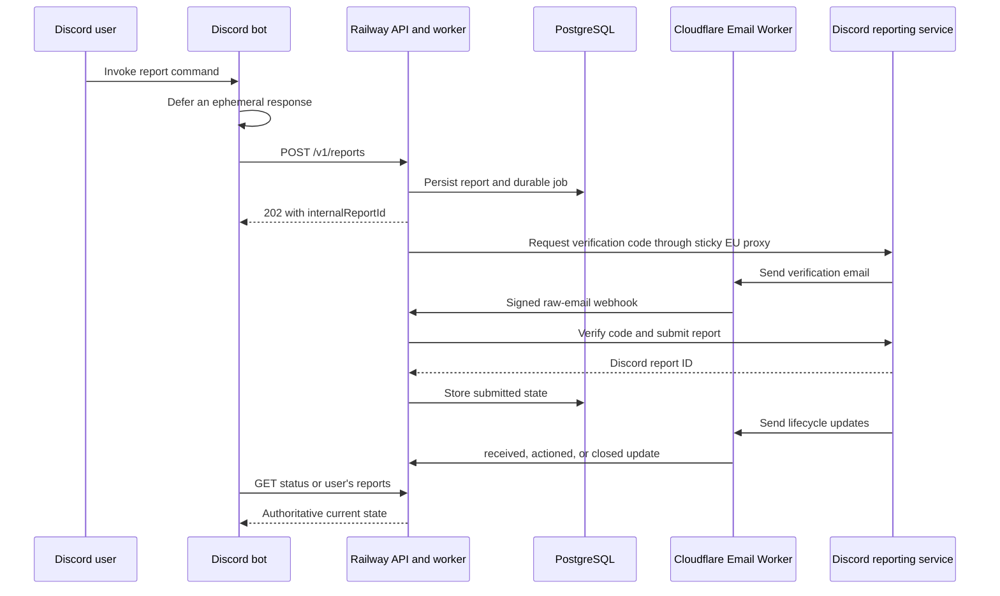

# Discord Bot API Integration Guide

Status: canonical bot-facing contract<br>
Base URL: `https://discord-dsa-production.up.railway.app`<br>
Last verified: 2026-07-19

This document is the source of truth for a Discord bot that creates and tracks
authorized EU DSA reports through the hosted reporting service. The bot must call this
Railway API. It must not call Discord's reporting endpoints, parse verification email,
generate reporter identities, or manage residential proxies itself.

## 1. Architecture and responsibility boundary



The backend owns:

- country-independent first-name plus last-name pseudonym and catch-all email generation;
- one sticky, country-specific proxy session for the original report lifecycle, plus a fresh
  country-specific proxy session for an appeal when needed;
- Discord fingerprint, cookie, verification-code, token, and menu handling;
- live breadcrumb resolution from the current Discord menu;
- durable jobs, retries, report ownership, and lifecycle-email correlation;
- encrypted transient Discord session state.

The bot owns:

- command permissions and user-facing validation;
- setting `submitterDiscordUserId` from the authenticated interaction user;
- generating and retaining idempotency keys;
- preventing one Discord user from viewing another user's report;
- ephemeral Discord responses and appropriate moderation/audit policy;
- choosing truthful report content and the correct semantic `reportType`.

## 2. Assumptions and non-goals

- Expected volume is tens of concurrent reports, not thousands per second.
- A report can take seconds or minutes because email delivery is asynchronous.
- The bot and API are controlled by the same organization.
- The bot runs on a trusted server; the API key is never shipped to a Discord client.
- The API is the sole report database. The bot does not duplicate report state.
- Bot-side automatic lifecycle retry, arbitrary reporter names, and arbitrary reporter
  emails are intentionally unsupported.
- The backend localizes the identity, proxy, locale, and timezone by country. Discord's
  verification-email request and final form-language field are independently fixed to the
  known-supported value `en`.

## 3. Bot environment

The bot needs only these reporting-service variables:

```text
DSA_API_BASE_URL=https://discord-dsa-production.up.railway.app
DSA_API_KEY=<same API_KEY configured on the Railway API service>
OPENROUTER_API_KEY=<bot-only OpenRouter key>
OPENROUTER_MODEL=minimax/minimax-m2.7
```

Keep both API keys in the bot host's secret manager. Never place them in slash-command
options, embeds, exception messages, source control, or browser-delivered code.

## 4. HTTP conventions

All bot-facing endpoints except `/healthz` require:

```http
Authorization: Bearer <DSA_API_KEY>
```

JSON requests also require:

```http
Content-Type: application/json
```

Report creation and manual retry additionally require:

```http
Idempotency-Key: <8 to 200 characters>
```

Recommended keys:

```text
create:<Discord interaction ID>
retry:<Discord interaction ID>
```

If a request times out or the bot loses the response, resend the exact same body with the
same idempotency key. Never generate a second key merely because the first response was
uncertain.

All error responses use:

```json
{
  "error": {
    "code": "machine_readable_code",
    "message": "Human-readable explanation."
  }
}
```

The global limit is 120 requests per minute per client IP. Report creation is limited to
20 per minute and lifecycle retry to 5 per minute. Treat HTTP `429` as retryable with
bounded backoff; do not bypass it with additional processes or addresses.

## 5. Report object

Every create, status, retry, and user-list response uses this shape:

```ts
type ReportFlow = "user_urf" | "message_urf" | "guild_urf";

type ReportStatus =
  | "queued"
  | "requesting_verification"
  | "awaiting_verification"
  | "verification_received"
  | "verifying"
  | "submitting"
  | "submitted"
  | "failed";

type DiscordReportStatus =
  | "received"
  | "actioned"
  | "closed_no_action"
  | "review_not_approved";

type DiscordReviewStatus =
  | "queued"
  | "requested"
  | "received"
  | "confirmation_timeout"
  | "request_failed"
  | "ineligible"
  | "request_ambiguous"
  | "approved"
  | "not_approved";

interface ReportSummary {
  internalReportId: string;
  country: string;
  flow: ReportFlow;
  reportType: string;
  submitterDiscordUserId: string | null;
  pseudonym: string;
  email: string;
  locale: string;
  timezone: string;
  lifecycleAttempt: number;
  retryable: boolean;
  retryOfReportId: string | null;
  retriedAsReportId: string | null;
  retrySequence: number;
  failureStage: ReportStatus | "pre_submission" | null;
  status: ReportStatus;
  discordReportId: string | null;
  discordStatus: DiscordReportStatus | null;
  discordStatusUpdatedAt: string | null;
  reviewStatus: DiscordReviewStatus | null;
  reviewStatusUpdatedAt: string | null;
  reviewError: { code: string; message: string | null } | null;
  resubmittable: boolean;
  error: { code: string; message: string | null } | null;
  createdAt: string;
  updatedAt: string;
}

interface ReportedUserSnapshot {
  userId: string;
  username: string;
  globalDisplayName: string | null;
  avatarUrl: string | null;
  bannerUrl: string | null;
  bot: boolean;
  resolvedAt: string;
}

interface ReportDetail extends ReportSummary {
  reportedDetails:
    | { kind: "message"; messageUrl: string; reportReason?: string; context?: string }
    | {
        kind: "profile";
        reportedUsername: string;
        reportedUserId?: string;
        reportedUserSnapshot?: ReportedUserSnapshot;
        reportedUserServerId?: string;
        profileElements: string[];
        reportReason?: string;
        context?: string;
      }
    | {
        kind: "server";
        guildIdOrInviteCode: string;
        guildElements: string[];
        reportReason?: string;
        context?: string;
      };
  timeline: Array<{
    eventId: string;
    type: string;
    occurredAt: string;
    lifecycleAttempt: number | null;
    discordStatus: DiscordReportStatus | null;
    errorCode: string | null;
  }>;
}
```

Do not display `email` publicly. It is an internal correlation address. The pseudonym is
generated organization-controlled identity data; it is not the invoking Discord user's
legal name.

### Submission status versus Discord status

`status` describes transport through the API. `submitted` means Discord returned a report
ID. `discordStatus` describes later email updates from Discord and does not replace
`status`.

Typical successful progression:

```text
queued
  -> requesting_verification
  -> awaiting_verification
  -> verification_received
  -> verifying
  -> submitting
  -> submitted
```

After submission, `discordStatus` can independently progress from `received` to
`actioned`, `closed_no_action`, or `review_not_approved`.

When an original `closed_no_action` email includes a valid Discord review link, the API
automatically queues and submits one appeal. `reviewStatus` exposes that separate lifecycle.
The API resolves the tracked link, reads Discord's token from the trusted
`https://discord.com/report-review#token=...` fragment, and posts only that token through a fresh
proxy session in the report's selected country; it does not rely on the original sticky IP or
Discord session. Neither the link nor token crosses the bot contract. Discord user authorization
is not part of this API-owned request.

After a successful review POST, `reviewStatus` is `requested`. The confirmation email advances it
to `received`. If no confirmation email arrives within 120 seconds, it becomes
`confirmation_timeout`; this is diagnostic and does not trigger a second POST. Pre-POST link
resolution can retry with bounded backoff, but a network-ambiguous review POST becomes
`request_ambiguous` and is never automatically retried. A successful appeal followed by a
`Report Actioned` email sets `discordStatus: "actioned"` and `reviewStatus: "approved"`. A final
denied review sets both `discordStatus: "review_not_approved"` and
`reviewStatus: "not_approved"`.

If Discord rejects the appeal POST with API code `521004`, the API records the first-class terminal
state `reviewStatus: "ineligible"` and emits `review_ineligible`. This means Discord says the DSA
report is not eligible for review; it is not treated as a transport failure and the appeal is not
retried. The state is not resubmittable by default.

After Discord returns a report ID, the API waits up to 120 seconds for the first report-update
email. If no update is correlated in that window, the report moves from `submitted` to a
retryable `failed` state with `discord_receipt_timeout`. A late valid update restores the timed-out
record to `submitted`, clears its retry flag and timeout error, and applies the received Discord
status. A successor already created from the timeout remains a separate lifecycle.

`awaiting_verification` has a fixed 60-second deadline. The API repeats the same Discord
verification-code request at 20 and 40 seconds while the report is still waiting, using the same
email alias, sticky proxy identity, and persisted Discord session. Resends never extend the
deadline. If the Cloudflare worker does not deliver an email before it expires, the API fails the
report with `verification_email_timeout`, stops resending/correlating that report, and emits a
retryable `report_failed` lifecycle event.

## 6. Endpoint reference

### `GET /healthz`

No authentication. Confirms both the HTTP service and database are reachable.

```json
{ "status": "ok" }
```

### `GET /v1/countries`

Returns the authoritative country codes accepted by report creation. The bot should load
this list during startup or deployment rather than maintaining a separate country list.

```http
GET /v1/countries
Authorization: Bearer <DSA_API_KEY>
```

```json
{
  "countries": ["AT", "BE", "BG", "CY", "CZ", "DE", "DK", "EE", "ES", "FI", "FR", "GR", "HR", "HU", "IE", "IT", "LT", "LU", "LV", "MT", "NL", "PL", "PT", "RO", "SE", "SI", "SK"]
}
```

### `POST /v1/reports`

Creates a durable report lifecycle. A new report returns HTTP `202`. Replaying the same
idempotency key with the same normalized request returns HTTP `200` and the existing
report. Reusing the key with different input returns HTTP `409`.

Common request fields:

| Field | Required | Rules |
|---|---:|---|
| `country` | yes | Two-letter value returned by `/v1/countries` |
| `flow` | yes | `user_urf`, `message_urf`, or `guild_urf` |
| `reportReason` | yes | User-supplied or AI-inferred factual explanation; maximum 512 characters |
| `reportType` | yes | Current semantic type listed in section 7 |
| `submitterDiscordUserId` | bot: yes | Interaction user's 15-22 digit snowflake |
| `context` | no | Final reviewed report text; non-empty when present; maximum 512 characters |
| `reporterUsername` | no | Organization's Discord username; maximum 100 characters |

Identity fields such as `name`, `legalName`, `email`, `reporterLegalName`, and
`reporterEmail` are rejected. The backend generates them.

#### Message report

```http
POST /v1/reports
Authorization: Bearer <DSA_API_KEY>
Idempotency-Key: create:123456789012345678
Content-Type: application/json
```

```json
{
  "country": "DE",
  "flow": "message_urf",
  "reportReason": "The message contains hateful content targeting a protected group.",
  "reportType": "sub_other_hate_speech",
  "submitterDiscordUserId": "1197857362942378017",
  "messageUrl": "https://discord.com/channels/427067963137589258/427069953078853633/1414818522701369355",
  "context": "Explain specifically why the message is unlawful in the selected jurisdiction."
}
```

`messageUrl` must be a complete `https://discord.com/channels/.../.../...` URL. Guild IDs
or `@me`, channel IDs, and message IDs are accepted in the appropriate positions.

#### User-profile report

```json
{
  "country": "DE",
  "flow": "user_urf",
  "reportReason": "The profile name contains content associated with account theft.",
  "reportType": "sub_other_cybercrime",
  "submitterDiscordUserId": "1197857362942378017",
  "reportedUsername": "reported-user",
  "reportedUserId": "123456789012345678",
  "reportedUserSnapshot": {
    "userId": "123456789012345678",
    "username": "reported-user",
    "globalDisplayName": "Reported Display Name",
    "avatarUrl": "https://cdn.discordapp.com/avatars/123456789012345678/example.png",
    "bannerUrl": "https://cdn.discordapp.com/banners/123456789012345678/example.png",
    "bot": false,
    "resolvedAt": "2026-07-20T12:00:00.000Z"
  },
  "reportedUserServerId": "1273300509318578227",
  "profileElements": ["name", "descriptors"],
  "context": "Explain which selected profile elements contain the unlawful material."
}
```

`profileElements` must contain at least one unique value from:

```text
photos
name
descriptors
```

`reportedUserServerId` is optional and, when supplied, must be a 15-22 digit Discord
snowflake.

New profile-report requests require `reportedUserId` and `reportedUserSnapshot`. The snapshot user
ID and username must match `reportedUserId` and `reportedUsername`. `reportedUsername` remains the
value submitted to Discord's DSA form. Historical report responses may omit the ID or snapshot
because reports created under the former name-only contract remain readable.

#### Server report

```json
{
  "country": "DE",
  "flow": "guild_urf",
  "reportReason": "The server channels coordinate stolen-account sales.",
  "reportType": "sub_other_cybercrime",
  "submitterDiscordUserId": "1197857362942378017",
  "guildIdOrInviteCode": "1273300509318578227",
  "guildElements": ["welcome_screen_description", "channel_names", "other"],
  "context": "Explain where the unlawful material appears and why it is unlawful."
}
```

`guildElements` must contain at least one unique value from:

```text
name
icon
banner
invite_splash
discovery_splash
welcome_screen_description
channel_names
other
```

`guildIdOrInviteCode` accepts either a server ID or an invite code and is limited to 100
characters.

#### Create response

```json
{
  "internalReportId": "timo-schmitt-74cjy1qvc1azcxy2",
  "country": "DE",
  "flow": "message_urf",
  "reportType": "sub_other_hate_speech",
  "submitterDiscordUserId": "1197857362942378017",
  "pseudonym": "Timo Schmitt",
  "email": "redacted@example.invalid",
  "locale": "de-DE",
  "timezone": "Europe/Berlin",
  "lifecycleAttempt": 1,
  "retryable": false,
  "retryOfReportId": null,
  "retriedAsReportId": null,
  "retrySequence": 0,
  "failureStage": null,
  "status": "queued",
  "discordReportId": null,
  "discordStatus": null,
  "discordStatusUpdatedAt": null,
  "reviewStatus": null,
  "reviewStatusUpdatedAt": null,
  "reviewError": null,
  "resubmittable": false,
  "error": null,
  "createdAt": "2026-07-19T22:34:12.605Z",
  "updatedAt": "2026-07-19T22:34:12.605Z"
}
```

### `GET /v1/reports/{internalReportId}`

Returns one current report view.

```http
GET /v1/reports/timo-schmitt-74cjy1qvc1azcxy2
Authorization: Bearer <DSA_API_KEY>
```

The API key grants access to any internal report ID. Before displaying the response, the
bot must verify:

```text
report.submitterDiscordUserId === interaction.user.id
```

An administrator-only command may deliberately bypass that comparison according to the
organization's moderation policy.

### `GET /v1/users/{discordUserId}/reports`

Returns the latest 100 reports owned by that Discord user, newest first.

```http
GET /v1/users/1197857362942378017/reports
Authorization: Bearer <DSA_API_KEY>
```

```json
{
  "reports": [
    { "internalReportId": "...", "status": "submitted", "discordReportId": "..." }
  ]
}
```

The actual objects contain every `ReportSummary` field. Fetch the selected report's
`ReportDetail` from `GET /v1/reports/{internalReportId}` before rendering it. A normal user-facing command must
always substitute `interaction.user.id`; never accept an arbitrary user ID option.

### `GET /v1/report-events`

Returns up to 100 externally meaningful lifecycle events after a numeric event cursor.
The bot uses this feed every 15 minutes to reconcile signed webhook delivery. This is the primary
recovery path for submitted reports: one feed request covers every tracked report. Per-report
polling is limited to active creation states, which are checked every 30 seconds. Individual
polling stops once a report is submitted. Tracking expires 60 days after creation; expiration
stops lifecycle DMs but does not delete report history or the API report. The bot acknowledges
post-expiry webhook events with HTTP `202` and discards them, while HTTP `409` remains reserved
for the short race where API report creation finished before bot tracking was linked.

```http
GET /v1/report-events?after=1234&limit=100
Authorization: Bearer <DSA_API_KEY>
```

Webhook and feed events contain `eventId`, `internalReportId`, `submitterDiscordUserId`,
`type`, `occurredAt`, and `lifecycleAttempt`. Ingest by immutable `eventId`; use the attempt
when deduplicating semantic status notifications. Webhook receipt must not advance the
reconciliation cursor because webhook events can arrive out of order.

Review lifecycle event types are `review_requested`, `review_received`,
`review_confirmation_timeout`, `review_request_failed`, `review_ineligible`, and
`review_request_ambiguous`.
Final outcomes continue to use `discord:actioned` or `discord:review_not_approved`.

### `POST /v1/reports/{internalReportId}/retry`

Creates a new successor report for either a safely retryable failed report or a final denied
review whose `resubmittable` field is true.

```http
POST /v1/reports/example-report-id/retry
Authorization: Bearer <DSA_API_KEY>
Idempotency-Key: retry:123456789012345678
Content-Type: application/json
```

```json
{
  "submitterDiscordUserId": "1197857362942378017",
  "reportReason": "Optional replacement text, at most 512 characters.",
  "context": "Optional replacement context, at most 512 characters."
}
```

`reportReason` and `context` overrides are accepted only for a final denied review. Omit both to
resend the same report. The backend verifies ownership, leaves predecessor reports immutable, and returns a new report with
a new `internalReportId`, pseudonym, catch-all email alias, sticky proxy session, database row, and
timeline. `retryOfReportId` links the successor to the failed report and `retriedAsReportId` links
the failed report forward to its successor. `retrySequence` records the attempt number but does not
impose a numeric ceiling. Replaying the same idempotency key returns the same successor rather than
creating another branch.

New retry: HTTP `202`. Idempotent replay: HTTP `200`.

Offer the ordinary retry control only when all are true:

```text
report.status === "failed"
report.retryable === true
report.submitterDiscordUserId === interaction.user.id
```

Offer the denied-review resend and rewrite controls only when:

```text
report.resubmittable === true
report.submitterDiscordUserId === interaction.user.id
```

The rewrite flow remains review-first and editable in the bot. It must enforce the existing
512-character limit before sending the override to this endpoint. Neither resend path spends
another credit.

Ambiguous final-submission outcomes are deliberately non-retryable. The explicit
`discord_receipt_timeout` state is the exception: Discord returned a report ID, but no receipt
email arrived within two minutes, so the API exposes a user-requested new-lifecycle retry.

## 7. Current report types

The bot sends semantic report-type strings. It must never send or store numeric
breadcrumbs. The backend fetches Discord's live menu and resolves the current numeric path
at processing time.

Discord can change its menus. Treat this catalog as the current command-choice list, not a
permanent copy of Discord's node graph.

### User-profile and message flows

| Suggested bot label | `reportType` |
|---|---|
| Sexualizing a minor | `sub_general_scrm_icwm` |
| Sexual contact involving a minor | `sub_icwm` |
| Minor posting or accessing adult sexual content | `sub_icaam` |
| Child sexual abuse material | `sub_csam` |
| Threat of physical harm | `threatening_behavior` |
| Glorifying violence | `sub_glorifying_violence` |
| Hate based on identity or vulnerability | `sub_racist_or_discriminatory_language_or_imagery` |
| Underage user | `sub_coppa` |
| Encouraging self-harm | `sub_self_harm_encouragement` |
| Stolen accounts or credit cards | `sub_cracked_accounts` |
| Drugs or illegal goods | `sub_illicit_goods` |
| Non-consensual intimate content | `sub_ncp` |
| Unwanted adult sexual content | `sub_unsolicited_porn` |
| Other: child safety | `sub_other_child_safety` |
| Other: threats or harassment | `sub_other_threats` |
| Other: cybercrime | `sub_other_cybercrime` |
| Other: hate speech | `sub_other_hate_speech` |
| Other: unwanted sexual content | `sub_other_unwanted_sexual_content` |

### Server flow

| Suggested bot label | `reportType` |
|---|---|
| Child safety | `sub_other_child_safety` |
| Threats or harassment | `sub_other_threats` |
| Cybercrime | `sub_other_cybercrime` |
| Hate speech | `sub_other_hate_speech` |
| Unwanted sexual content | `sub_other_unwanted_sexual_content` |

## 8. Error handling

### Immediate HTTP errors

| HTTP | Code | Bot behavior |
|---:|---|---|
| 400 | `invalid_idempotency_key` | Generate a valid stable interaction-derived key |
| 400 | `invalid_request` | Show a concise validation error to the invoking user |
| 400 | `invalid_discord_user_id` | Treat as a bot bug; interaction IDs should already be snowflakes |
| 401 | `unauthorized` | Alert operators; do not reveal credentials or retry rapidly |
| 403 | `report_owner_mismatch` | Deny the retry and do not disclose report details |
| 404 | `report_not_found` | Tell the user the report was not found |
| 409 | `idempotency_conflict` | Bot reused an interaction key with different input; log as a bug |
| 409 | `report_not_failed` | Refresh status; it is no longer failed |
| 409 | `report_not_retryable` | Explain that it cannot be retried safely |
| 429 | `rate_limited` | Back off; do not create a replacement key |
| 500+ | `internal_error` | Preserve the key and retry cautiously or ask the user to check later |

### Asynchronous report errors

Processing errors appear inside a `ReportView` after creation:

```json
{
  "status": "failed",
  "retryable": true,
  "failureStage": "requesting_verification",
  "error": {
    "code": "discord_http_429",
    "message": "Discord returned HTTP 429."
  }
}
```

Common classes:

| Code | Meaning |
|---|---|
| `discord_http_<status>` | Discord returned a definite HTTP error; safe structured details may follow |
| `discord_network_error` | A temporary proxy or network failure prevented contact with Discord |
| `report_processing_failed` | Network, proxy, menu, parsing, or local processing failed |
| `verification_email_timeout` | Discord's verification email did not arrive within 60 seconds |
| `discord_receipt_timeout` | Discord returned a report ID but did not confirm receipt within 120 seconds |
| `ambiguous_submission_state` | Worker stopped during verification/submission; manual review required |

Use `retryable` as the authority. Do not infer retry safety from the text or HTTP number.

## 9. Recommended Discord command contract

Implemented user-installed app commands:

```text
/report message message-link
/report profile target [server-id]
/report server [server-or-invite]
/reports status report-id
/reports list
/reports retry report-id
/access redeem key
/access status
/settings country country
Apps -> Report Message
Apps -> Quick Report Message
Apps -> Experimental 10x Same Category
Apps -> Experimental All Categories
```

The two experimental message commands use the ordinary single-report API contract repeatedly; the
API has no batch endpoint and the bot never crosses its service boundary. **Experimental 10x Same
Category** snapshots the target message, lets the first AI preparation choose one category, and
creates ten distinct report reasons and report IDs in that category. **Experimental All
Categories** snapshots the current `message_urf` semantic catalog and creates one report per
captured category, so its count follows the complete catalog rather than a fixed limit of ten.

The interaction defers and returns as soon as the bot has transactionally reserved the complete
batch: ten credits for the same-category command or the catalog snapshot count for all-categories.
Configured administrators and `WHITELIST_ENABLED=false` retain the existing credit bypass. A
durable bot worker then processes at most two items concurrently. Each AI preparation may be
attempted twice. Definite failures before API creation release only that item's reservation;
accepted API reports consume their item reservation.

Every item has its own stable create identity. A rate-limited create gets one retry, while an
unknown or server-side create outcome is reconciled with the same identity and encrypted input.
After creation, the bot calls the existing retry endpoint at most once only when the API returns a
failed report with `retryable: true`; this successor spends no additional credit. It never retries
`ambiguous_submission_state` or any result where `retryable` is false. Batch-linked lifecycle
events suppress ordinary per-report DMs and wake the batch worker. The worker fetches authoritative
report detail and creates or edits one aggregate private status card. The card shows the bounded
original targeted message once near the top, then each category's reason, report IDs, retry/error
details, and latest outcome. Latest-outcome precedence is appeal status, Discord report status,
API report status, then the bot worker state; the card does not grow a separate item history.

The profile `target` accepts only a 15-22 digit raw Discord user ID. Usernames, display names, and
mentions are rejected. The bot resolves the ID and shows the account for confirmation before
opening the report form.

`/settings country` accepts `AUTO` or a code returned by `/v1/countries`. Each report opens one
combined modal where the reporter can use Auto, keep the saved/current country, or open the paginated country
picker. A missing or `NULL` saved default means Auto. Auto uses AI to select one supported code
based on conduct and legal relevance, never guessed location.

The combined modal allows category and explanation to be omitted as `Auto`. A case-insensitive
literal `Auto` reason is also treated as omitted while AI is enabled. Normally one adaptive research
completion resolves only omitted fields and always returns the law reference and summary. Supplied
country, category, and reason values stay application-owned and are omitted from the model's output
schema. The schema is strict and contains only the dynamically required fields. When category is
Auto, only the active flow's catalog is supplied for selection.
OpenRouter's web plugin performs one Parallel search with at most two results. When unfamiliar,
coded, ambiguous, or context-dependent terminology could affect classification or legal relevance,
the model uses the search to clarify the exact evidence wording and confirm the relevant current
law and provision. With explicit evidence it focuses directly on the law. Category-catalog labels
and unrelated categories are forbidden as search terms. OpenRouter must choose a provider that
supports the requested strict schema and plugin parameters. If a completed research response is
malformed, the bot retries the research once from the original evidence without replaying the failed
response. A missing `server_tool_use.web_search_requests` value is retained as telemetry and does not
invalidate plugin-backed research. A second malformed response stops the workflow with the safe AI
error response.
The writing prompt asks the final maximum-512-character text to naturally name the structured
research result's specific law or provision. Brackets, URLs, footnotes, OpenRouter URL annotations,
and a separate sources section are not required. Bot validation requires only non-empty text of at
most 512 characters; it does not verify that the law exists or require the final text to retain
the law reference.
The law reference includes its country, clear full law title, and relevant provision before any
abbreviation, such as `Germany's Criminal Code (StGB), §86a` rather than `§86a StGB`.

AI media processing is temporarily disabled for all categories. The bot does not attach images,
GIFs, videos, avatars, banners, server art, or media URLs to OpenRouter. It removes profile/server
media URLs plus message attachment/embed URLs from AI evidence. Attachment names and content types
may remain as text metadata.

The writing completion receives a compact context containing evidence, resolved values, law
reference, and legal summary. It does not receive the supported-country list, category catalog,
search instructions, or raw research transcript. Refine continues this encrypted compact
conversation and reuses the existing research without searching.
Repair continues the same conversation without search and receives one attempt. Regenerate reruns
adaptive research, and changing country clears the conversation. MiniMax M2.7 uses mandatory
reasoning without an effort-level override. Report-producing calls have a 4,096-token completion
budget while final report text remains limited to 512 characters.

The combined report modal places report category, flow-specific elements, and report details before
country and the default-on Use AI and Send review to DMs preferences; no setup embed is shown.
Blank category/details help text explains that AI fills the field when Use AI is enabled. Clearing Use AI requires the
reporter to supply the final maximum-512-character text, makes no OpenRouter call, and omits
AI-only review controls. Auto cannot resolve a country without AI, so the bot requires a saved or
selected country before showing the manual review. When DM delivery is enabled, the first drafting
status creates one structured report card in DMs. Research, writing, refinement, review, submission,
and later lifecycle updates edit that same message. The shared card uses Item, Status, Category,
Country, Details, AI decisions, References, Dates, and Appeal; it does not duplicate Details in a
Reason field. AI decisions are bot-owned, bounded before/after summaries with timestamps; they do
not contain model reasoning or change the bot-to-API request. Lifecycle history hides verification
and receipt transport noise, distinguishes the original report result from the appeal result, and
bolds the latest stage without bolding its relative timestamp. The modal acknowledgement is the
minimal `Check your DMs.`
Clearing DM delivery keeps the draft/review ephemeral and suppresses later lifecycle
DMs for that report. The bot-to-API request shape remains unchanged.

Only the resolved ISO country, exact semantic category, concise report reason, and final reviewed
text cross the bot-to-API boundary. Message content, author details, embed summaries,
attachments, country-selection reasoning, sources, research, and conversation remain in the
encrypted, expiring bot draft. OpenRouter usage is accumulated per bot user; logs include operational
diagnostics but exclude credentials, verification codes, and raw email.

The app is registered globally with `USER_INSTALL` only. Admin key/user commands are
documented in [`BOT_IMPLEMENTATION.md`](BOT_IMPLEMENTATION.md). The bot stores access,
encrypted draft, experimental-batch, idempotency-reconciliation, and notification metadata in a separate
database, but the API remains the sole authoritative report database.

For `/dsa-status` and `/dsa-retry`, fetch the report first and compare its
`submitterDiscordUserId` with `interaction.user.id` before displaying anything.

Use ephemeral responses for report IDs, context, error messages, generated identity data,
and Discord decisions. Discord requires an initial interaction response within three
seconds; defer immediately before calling this API. Interaction tokens remain usable for
follow-ups for a limited period, but the report itself can outlive that window. Therefore:

1. Defer the interaction ephemerally.
2. Create the report with `create:<interaction.id>`.
3. Poll every two seconds for at most roughly 10-12 seconds.
4. If submitted or failed, edit the deferred reply with the result.
5. Otherwise, return the internal report ID and direct the user to `/dsa-status`.
6. Do not keep an in-memory timer running indefinitely.

Official Discord interaction timing reference:
<https://docs.discord.com/developers/interactions/receiving-and-responding>

## 10. TypeScript API adapter

This dependency-free adapter can live inside a TypeScript Discord bot:

```ts
export type ReportFlow = "user_urf" | "message_urf" | "guild_urf";

export interface ApiErrorBody {
  error: { code: string; message: string };
}

export class DsaApiError extends Error {
  constructor(
    public readonly status: number,
    public readonly code: string,
    message: string
  ) {
    super(message);
    this.name = "DsaApiError";
  }
}

export class DsaApi {
  constructor(
    private readonly baseUrl: string,
    private readonly apiKey: string
  ) {}

  private async request<T>(
    path: string,
    init: RequestInit = {}
  ): Promise<T> {
    const response = await fetch(new URL(path, this.baseUrl), {
      ...init,
      headers: {
        authorization: `Bearer ${this.apiKey}`,
        accept: "application/json",
        ...init.headers
      },
      signal: AbortSignal.timeout(15_000)
    });

    const body = (await response.json()) as T | ApiErrorBody;
    if (!response.ok) {
      const apiError = body as ApiErrorBody;
      throw new DsaApiError(
        response.status,
        apiError.error?.code ?? "unknown_error",
        apiError.error?.message ?? `HTTP ${response.status}`
      );
    }
    return body as T;
  }

  countries(): Promise<{ countries: string[] }> {
    return this.request("/v1/countries");
  }

  createReport(
    interactionId: string,
    input: Record<string, unknown>
  ): Promise<ReportView> {
    return this.request("/v1/reports", {
      method: "POST",
      headers: {
        "content-type": "application/json",
        "idempotency-key": `create:${interactionId}`
      },
      body: JSON.stringify(input)
    });
  }

  report(internalReportId: string): Promise<ReportView> {
    return this.request(`/v1/reports/${encodeURIComponent(internalReportId)}`);
  }

  reportsFor(discordUserId: string): Promise<{ reports: ReportView[] }> {
    return this.request(
      `/v1/users/${encodeURIComponent(discordUserId)}/reports`
    );
  }

  retryReport(
    internalReportId: string,
    interactionId: string,
    discordUserId: string,
    overrides: { reportReason?: string; context?: string } = {}
  ): Promise<ReportView> {
    return this.request(
      `/v1/reports/${encodeURIComponent(internalReportId)}/retry`,
      {
        method: "POST",
        headers: {
          "content-type": "application/json",
          "idempotency-key": `retry:${interactionId}`
        },
        body: JSON.stringify({ submitterDiscordUserId: discordUserId, ...overrides })
      }
    );
  }
}
```

Copy the complete `ReportView`, `ReportStatus`, `DiscordReportStatus`, and
`DiscordReviewStatus` definitions from
section 5 into the adapter module.

### Framework-neutral command handler

```ts
await interaction.deferEphemeral();

const report = await dsaApi.createReport(interaction.id, {
  country: options.country,
  flow: "message_urf",
  reportReason: options.reportReason,
  reportType: options.reportType,
  submitterDiscordUserId: interaction.user.id,
  messageUrl: options.messageUrl,
  context: options.context
});

let current = report;
for (let attempt = 0; attempt < 5; attempt += 1) {
  if (current.status === "submitted" || current.status === "failed") break;
  await new Promise((resolve) => setTimeout(resolve, 2_000));
  current = await dsaApi.report(report.internalReportId);
}

await interaction.editEphemeral(renderReport(current));
```

Adapt `deferEphemeral` and `editEphemeral` to the Discord library in use. Do not put the API
key or raw API error object in the rendered response.

## 11. Bot-side authorization rules

These rules are mandatory because all bot instances share one backend API key:

1. Always derive `submitterDiscordUserId` from the interaction; never accept it as an option.
2. Before rendering a single report, compare its owner to the interaction user.
3. Normal users may list only `/v1/users/{interaction.user.id}/reports`.
4. Retry only after the owner comparison and when either `retryable` or `resubmittable` is true.
   Send reason/context overrides only for `resubmittable` denied-review reports.
5. Administrator access must be an explicit bot permission path and should be audited.
6. Keep report responses ephemeral by default.
7. Escape or suppress Discord mentions when rendering user-supplied context or errors.

## 12. Operational behavior

- The backend worker must remain enabled with `WORKER_ENABLED=true`.
- Cloudflare must route the report domain catch-all to the email worker.
- A successful verification email is matched using the exact SMTP envelope recipient.
- Verification codes are extracted first from Discord's exact supported English or German subject
  form, then from the same verification phrase in the plain-text body. The parser also recognizes
  the `ü` mojibake form observed in Railway. Codes may be letter-only or alphanumeric; broad
  six-character scanning is intentionally forbidden because ordinary words and HTML color values
  are unsafe matches.
- After verifying the sender is exactly `noreply@discord.com`, the parser has a language-independent
  fallback for a six-character uppercase alphanumeric token at the very end of the subject. The
  token must contain at least one letter. This fallback never scans arbitrary body text and is not
  exposed through the sender-agnostic extraction helper.
- Ignored-email logs classify unmatched Discord verification/lifecycle subjects and include only
  a bounded, sanitized subject and text preview. Generated email addresses and code candidates are
  redacted; raw MIME and HTML are not logged.
- Multiple reports can wait concurrently because every generated address is unique.
- Inbound email can win the race with initial session persistence; saving the session preserves an
  already-recorded `verification_received` state so the report never moves backwards.
- A delayed email for a failed report cannot verify its successor because every retry has a new alias.
- The backend stores the latest 100 reports per user through the list endpoint; the database
  retains more unless separately maintained.
- Restarting during code-request work is recoverable. Restarting during verification or
  submission is treated as ambiguous and is not automatically retried.
- An eligible original no-action review link is encrypted immediately, resolved only through
  Discord's trusted hosts, and submitted once by the API worker. Review URLs and tokens never
  enter bot responses or structured logs.
- Missing review-request confirmation after 120 seconds updates `reviewStatus` but does not retry
  the appeal POST. A worker restart or network failure during that POST is recorded as ambiguous.

## 13. Implementation checklist

- [ ] Add `DSA_API_BASE_URL` and `DSA_API_KEY` to the bot secret manager.
- [ ] Load `/v1/countries` for the country choice list.
- [ ] Register report, status, list, and retry commands.
- [ ] Defer every report interaction immediately and ephemerally.
- [ ] Use the interaction ID as the idempotency-key suffix.
- [ ] Always send `interaction.user.id` as `submitterDiscordUserId`.
- [ ] Enforce owner comparison before showing a single report.
- [ ] Use only the semantic report types in section 7.
- [ ] Poll briefly, then rely on `/dsa-status` and `/dsa-reports`.
- [ ] Show failure retry only when `retryable` is true; show denied-review resend/rewrite only
      when `resubmittable` is true.
- [ ] Keep API keys, verification codes, and raw email out of logs.
- [ ] Handle `429`, transport timeouts, and idempotency replay.
- [ ] Test against a mock API before running an authorized live report.
- [ ] Confirm one controlled end-to-end report returns both `discordReportId` and
      `discordStatus: "received"`.

## 14. Decision log

- The Railway backend is the bot's only report API; direct Discord integration was rejected
  because it would duplicate token, email, proxy, menu, and retry logic.
- The API remains language-neutral HTTP; a TypeScript adapter is included as the primary bot
  example without coupling the service to one Discord framework.
- `submitterDiscordUserId` is the ownership key; a second bot database was rejected to avoid
  cross-database drift.
- Discord interaction IDs are idempotency keys; random keys were rejected because they make
  interaction delivery retries capable of creating duplicate reports.
- Replies are ephemeral by default so report interactions remain scoped to the initiating user.
- The bot polls briefly during submission, then uses durable 15-minute fallback polling alongside
  webhook delivery and event-feed reconciliation until Discord returns a terminal outcome.
- Numeric breadcrumbs remain entirely backend-owned and runtime-resolved.
- Manual retry remains explicit, owner-checked, unlimited for safely retryable failures, and unavailable after unsafe
  submission failures.
- Eligible original no-action decisions are appealed automatically inside the API. The review
  link is encrypted at rest, tokens never cross the bot boundary, and no Discord account
  authorization header is used.
- Missing review-confirmation email is diagnostic only. The successful review POST remains
  authoritative, so timeout and ambiguous POST states never cause an automatic duplicate appeal.
- A final denied appeal enables one linked successor lifecycle. The owner may resend the same
  report or submit bot-reviewed replacement reason/context text without another credit.

## 15. Related internal documentation

- [`../BACKEND_DESIGN.md`](../BACKEND_DESIGN.md): backend architecture and persistence decisions.
- [`../CLIENT_DESIGN.md`](../CLIENT_DESIGN.md): low-level Discord client boundary.
- [`../DISCORD_DSA_API_HANDOFF.md`](../DISCORD_DSA_API_HANDOFF.md): historical Discord workflow capture.
- [`../HEADER_TEST_RESULTS.md`](../HEADER_TEST_RESULTS.md): request-header experiments.
- [`../IPOASIS_PROXY_NOTES.md`](../IPOASIS_PROXY_NOTES.md): proxy-provider-specific notes.

The files above are implementation references. Bot developers should start with this guide.
